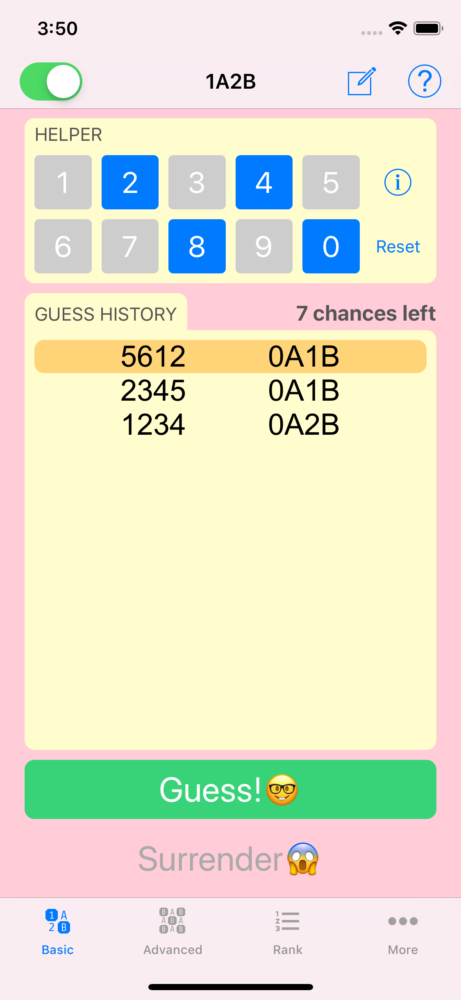
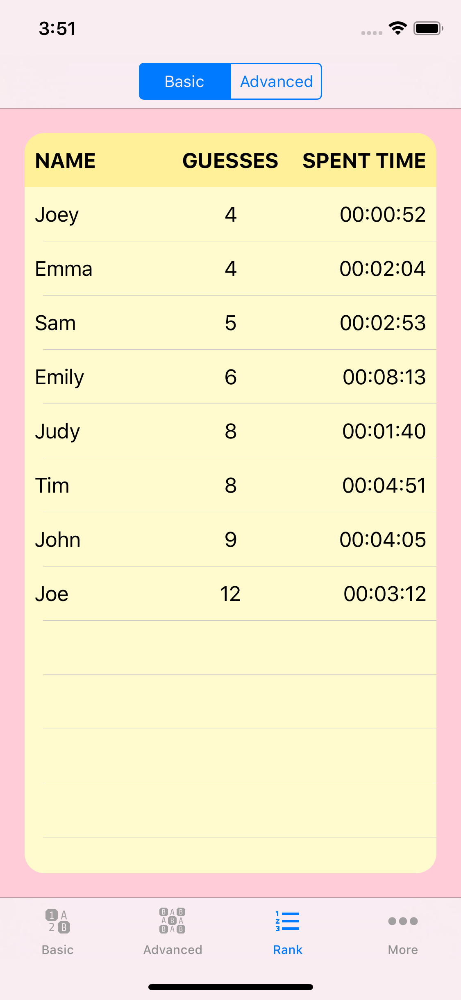
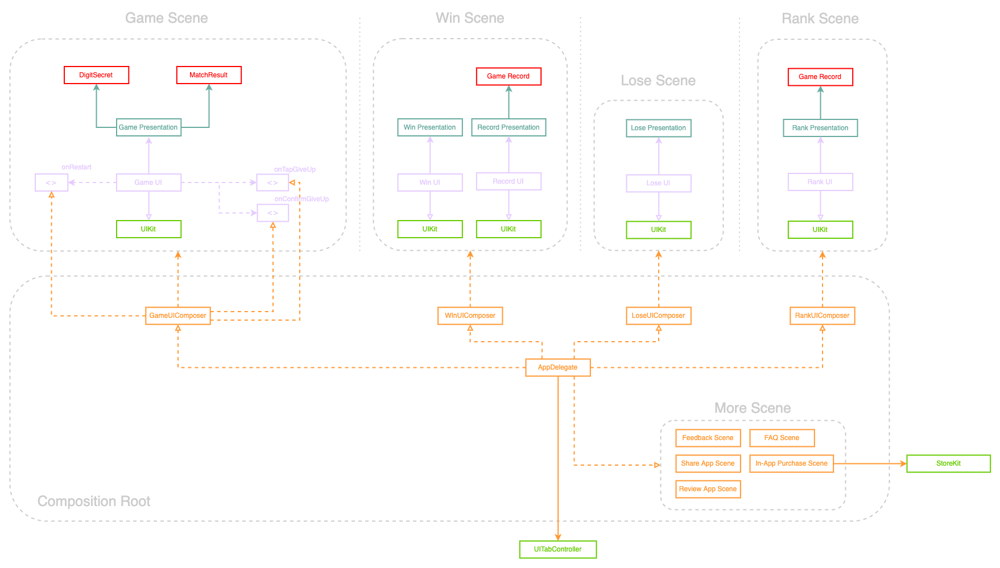

# 1A2B Fun!
 

Hi! I'm Sam. **1A2B Fun!** was the first project I uploaded in the app store in 2018.
I've refactor the code to use **modular design** to show that how we can decouple the code to create a more flexible, composable structure.  
The App Store page can be found [here](https://apps.apple.com/app/id1459347669).

> **_NOTE:_**  The project only acts as a demonstration. In reality, it depends on the use cases to decide how modular our code should be.

## What I did:
  - Separate a single application into frameworks, so the `Mastermind`, `MastermindiOS` frameworks can be re-used across multiple projects.
  - Separate a single project into two projects for better management.
  - UI Design with MVP pattern.
  - Support Darkmode.
  - Support multiple languages with localized string.
  - Snapshot testing.
  - Unit testing.
  - Integration testing.
  - Acceptance testing.
  - CI/CD (using Github Action).

## How to run:
  - Clone the repository
  - Open My1A2BGame.xcworkspace
  - To run the application, choose `My1A2BGame` scheme
  - To run all the test, choose `CI` scheme

## App Screenshots  
Game Scene                 |  Rank Scene
:-------------------------:|:-------------------------:
         |  

##  App Architecture

